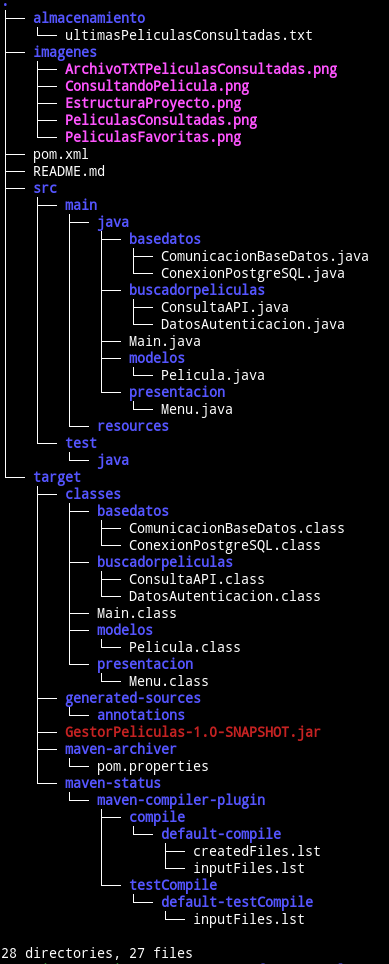

# API Gestor de Peliculas 🎥

### Descripcion:
🎬 Sistema de Gestión y Búsqueda de Películas:

Este sistema permite la 📡 búsqueda y gestión de películas a 
través de la API de OMDb, formando parte de la especialización
en desarrollo backend con Java del programa ONE
(Oracle Next Education).

🔍 Características principales:

🎞️ Búsqueda de múltiples títulos disponibles en la API con 
acceso a información detallada de cada película.

⭐ Posibilidad de agregar películas a una lista de favoritos,
almacenada en una base de datos diseñada en PostgreSQL 🗄️.

✏️ Los usuarios pueden modificar su lista de favoritos
directamente desde el menú del sistema.

📊 Gestión de datos y exportación:

🗃️ La base de datos registra automáticamente todas las consultas
realizadas.

📄 Como funcionalidad adicional, el sistema genera un archivo 
.txt con las películas consultadas en formato JSON 📦, 
facilitando su intercambio con otras personas.

🚀 Un proyecto ideal para reforzar habilidades en desarrollo 
backend con Java, gestión de APIs y manejo de bases de datos.

- Peliculas favoritas:

- Peliculas consultadas:

- Archivo generado .txt con las peliculas consultadas:

## Lo que aprendí con este proyecto:
Este proyecto me permitió desarrollar y fortalecer diversas 
habilidades clave en el desarrollo backend con Java:

☕ Java y Backend: Profundicé en la creación de aplicaciones
backend robustas, implementando un sistema con múltiples 
funcionalidades.

📡 Consumo de APIs REST: Aprendí a realizar peticiones HTTP a
la API de OMDb, manejar respuestas JSON y presentar la
información de manera estructurada.

🗄️ Bases de Datos con PostgreSQL: Mejoré mis habilidades en
diseño y gestión de bases de datos relacionales, incluyendo 
la persistencia de datos y registros de actividad.

⭐ Gestión de Favoritos: Implementé la funcionalidad de agregar,
modificar y almacenar favoritos de manera eficiente, aplicando
buenas prácticas de manipulación de datos.

📦 Generación y Exportación de Archivos: Incorporé la
generación de archivos .txt en formato JSON para facilitar 
la exportación e intercambio de información.

🛠️ Buenas Prácticas y Organización del Código: Practiqué la
separación de responsabilidades, modularidad y uso de menús 
interactivos para mejorar la experiencia del usuario.

🚀 Este proyecto no solo reforzó mis habilidades técnicas,
sino también mi capacidad para desarrollar soluciones completas
y funcionales, aplicando buenas prácticas y herramientas 
modernas del desarrollo backend.

### Objetivos del proyecto:
1. Poner en practica los conocimientos adquiridos en la primera
formacion del programa ONE sobre desarrollo backend con Java.

2. Crear un proyecto a partir de lo aprendido.

3. Hacer consumo de una API y utilizar los datos obtenidos en una aplicacion 
   desarrollada en Java.

4. Trabajar con librerias externas y hacer uso de Maven como gestor de 
   dependencias para Java.

5. Trabajar con datos en formato JSON haciendo uso de la libreria Gson y 
   convertirlos en objetos soportados en Java, para posteriormente enviarlos
   a una base de datos en PostgreSQL.

6. Conocer mejor el protocolo HTTP y sus metodos(GET - POST - PUT - DELETE).

- Estructura del proyecto:

  

### Tecnologias utilizadas:
1. Java JDK 21 corretto 21.0.4 como lenguaje de programacion.
2. Maven como gestor de dependencias.
3. Librerias Externas (OkHttp - Gson - conector postgresql 42.7.2).
4. Postman para realizar pruebas.
5. PostsgreSQL como motor de base de datos.
6. IntelliJ-Idea como IDE.
7. API de OMDb para obtener datos (https://www.omdbapi.com/).